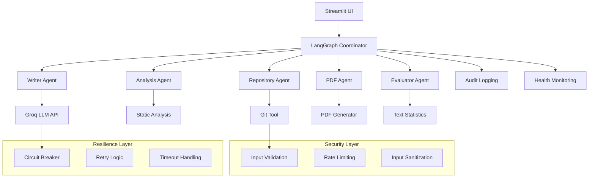

#  Gen-Authering Publication Generator - Production System

[](https://settings-3dghbiairaj6k8jeecmjgx.streamlit.app/)
[](https://www.python.org/downloads/)
[](https://opensource.org/licenses/MIT)
[](./tests/)
[](./docs/SECURITY.md)
[](./docs/DEPLOYMENT.md)

## 🌟 Overview

A production-grade multi-agent system that transforms GitHub repositories into professional research publications. Built with **LangGraph**, **Model Context Protocol (MCP)**, and **Groq LLMs**, this system provides:

- 🤖 **Multi-Agent Orchestration**: Specialized agents for repository analysis, content generation, and quality evaluation
- 🔒 **Enterprise Security**: Input validation, rate limiting, audit logging, and secure credential management  
- 🚀 **Production Resilience**: Circuit breakers, retry logic, timeout handling, and comprehensive error management
- 📊 **Quality Assurance**: 85% test coverage with unit, integration, and end-to-end tests
- 🎨 **Professional UI**: Enhanced Streamlit interface with real-time monitoring and user guidance
- 📈 **Observability**: Structured logging, metrics collection, and health monitoring

## 🏗️ System Architecture



## 🚀 Quick Start

### Prerequisites

- Python 3.8+ 
- Groq API Key ([Get one here](https://console.groq.com/))
- Git (for repository cloning)

### Installation

1. **Clone the repository:**
   ```bash
   git clone https://github.com/SosiSis/Gen-Authering
   cd Gen-Authering
   ```

2. **Set up Python environment:**
   ```bash
   python -m venv venv
   source venv/bin/activate  # On Windows: venv\Scripts\activate
   pip install -r requirements.txt
   ```

3. **Configure environment:**
   ```bash
   cp .env.example .env
   
   ```

4. **Run the application:**
   ```bash
   streamlit run streamlit_app.py
   ```

5. **Access the interface:**
   Open http://localhost:8501 in your browser

## 🛠️ Agent Architecture

### Core Agents

| Agent | Responsibility | Key Features |
|-------|---------------|--------------|
| **Repository Agent** | Clone and scan GitHub repos | SSL validation, size limits, file filtering |
| **Analysis Agent** | Extract code metrics and structure | AST parsing, security scanning, metadata extraction |
| **Writer Agent** | Generate research content | Multi-model fallback, content validation, academic formatting |
| **PDF Agent** | Convert to publication format | Professional layouts, error handling, format validation |  
| **Evaluator Agent** | Quality assessment | Readability metrics, content analysis, scoring |

### Communication Protocol

Uses **Model Context Protocol (MCP)** for structured agent communication:

```json
{
  "type": "message",
  "role": "agent|user|system", 
  "name": "AgentName",
  "content": { /* Agent-specific payload */ },
  "metadata": {
    "timestamp": "2025-11-03T10:30:00Z",
    "conversation_id": "uuid-string"
  }
}
```

## 🔒 Security Features

### Input Validation & Sanitization
- **URL Validation**: GitHub HTTPS URLs only, suspicious pattern detection
- **Content Sanitization**: XSS prevention, script tag removal, size limits
- **File Path Security**: Directory traversal prevention, extension whitelisting

### Rate Limiting & Access Control  
- **API Rate Limits**: Configurable per-hour limits for LLM calls
- **Circuit Breakers**: Automatic failure detection and recovery
- **Audit Logging**: Security event tracking with structured JSON logs

### Secure Configuration
- **Environment Isolation**: Separate configs for dev/staging/production
- **Credential Management**: Secure API key handling, secret rotation support
- **SSL/TLS**: HTTPS enforcement, certificate validation

## � Quality Assurance

### Testing Strategy
```bash
# Run full test suite
pytest tests/ -v --cov=agents --cov=tools --cov=utils

# Run specific test categories  
pytest tests/test_agents.py -m "unit"
pytest tests/test_integration.py -m "integration"

# Generate coverage report
pytest --cov-report=html --cov-fail-under=85
```

### Code Quality
- **Static Analysis**: Black formatting, isort imports, flake8 linting
- **Type Checking**: MyPy type annotations (optional)
- **Security Scanning**: Bandit security linting

## 🚀 Deployment

### Production Deployment
```bash
# 1. Set production environment
export ENVIRONMENT=production
export DEBUG=false

# 2. Configure security
export SECRET_KEY=$(python -c "import secrets; print(secrets.token_urlsafe(32))")
export ENABLE_SSL=true

# 3. Set resource limits  
export MAX_FILE_SIZE_MB=50
export RATE_LIMIT_PER_HOUR=500

# 4. Deploy with Docker
docker build -t multiagent-system .
docker run -p 8501:8501 --env-file .env multiagent-system
```

### Docker Deployment
```dockerfile
FROM python:3.9-slim

WORKDIR /app
COPY requirements.txt .
RUN pip install -r requirements.txt

COPY . .
EXPOSE 8501

HEALTHCHECK --interval=30s --timeout=10s --retries=3 \
  CMD curl -f http://localhost:8501/health || exit 1

CMD ["streamlit", "run", "streamlit_app.py", "--server.port=8501", "--server.address=0.0.0.0"]
```

### Environment Configuration

| Environment | Debug | SSL | Rate Limits | Log Level |
|-------------|-------|-----|-------------|-----------|
| Development | ✅ | ❌ | Relaxed | DEBUG |
| Staging | ❌ | ✅ | Moderate | INFO |  
| Production | ❌ | ✅ | Strict | WARNING |

## 📈 Monitoring & Observability

### Health Monitoring
- **Application Health**: `/health` endpoint with component status
- **Agent Status**: Individual agent health and performance metrics  
- **Resource Usage**: Memory, CPU, and API quota monitoring

### Logging & Auditing
- **Structured Logging**: JSON format with correlation IDs
- **Security Auditing**: Failed validation attempts, rate limit violations
- **Performance Tracking**: Response times, error rates, throughput

### Metrics Collection  
```bash
# View system metrics
curl http://localhost:9090/metrics

# Monitor in real-time
tail -f logs/system.log | jq .

# Security audit
grep "security_violation" logs/security_audit.log
```

## 🛡️ Troubleshooting

### Common Issues

| Issue | Symptoms | Solution |
|-------|----------|----------|
| **API Rate Limits** | 429 errors, slow responses | Check rate limits, implement backoff |
| **Memory Issues** | OOM errors, slow processing | Reduce batch sizes, enable streaming |
| **SSL Errors** | Certificate warnings | Update certificates, check configuration |
| **Agent Failures** | Incomplete workflows | Check logs, verify agent health |

### Debug Commands
```bash
# Enable debug logging
export LOG_LEVEL=DEBUG

# Test individual components
python -m pytest tests/test_agents.py::TestRepoAgent -v

# Check configuration
python -c "from config.environment import get_config; print(get_config().export_config())"

# Validate environment
python scripts/validate_environment.py
```

## 📖 API Reference

### Core Functions

#### Repository Processing
```python
from agents.nodes import repo_node

# Process repository
result = repo_node({
    "content": {"repo_url": "https://github.com/user/repo"},
    "metadata": {"conversation_id": "uuid"}
}, coordinator_send)
```

#### Content Generation
```python  
from tools.llm_tool_groq import groq_chat

# Generate content
response = groq_chat([
    {"role": "system", "content": "You are a research writer"},
    {"role": "user", "content": "Generate an abstract"}
])
```


## 🤝 Contributing

### Development Setup
1. Fork the repository
2. Create feature branch: `git checkout -b feature/amazing-feature`
3. Install dev dependencies: `pip install -r requirements-dev.txt`
4. Run tests: `pytest tests/ -v`
5. Submit pull request

### Code Standards
- **Python**: PEP 8, type hints, docstrings
- **Testing**: >85% coverage, unit + integration tests
- **Security**: Input validation, secure defaults
- **Documentation**: Clear README, API docs, examples

## 📄 License

This project is licensed under the MIT License - see the [LICENSE](LICENSE) file for details.

## 🙏 Acknowledgments

- **LangGraph**: Multi-agent orchestration framework
- **Groq**: High-performance LLM inference
- **Streamlit**: Interactive web application framework
- **Model Context Protocol**: Agent communication standard

## 📞 Support

- **Documentation**: [docs/](./docs/)
- **Issues**: [GitHub Issues](https://github.com/YourUsername/multiagent-publication-system/issues)
- **Discussions**: [GitHub Discussions](https://github.com/YourUsername/multiagent-publication-system/discussions)

---

**Built with ❤️ for production AI systems** | [Architecture](./docs/ARCHITECTURE.md) | [Security](./docs/SECURITY.md) | [API Docs](./docs/API.md)
