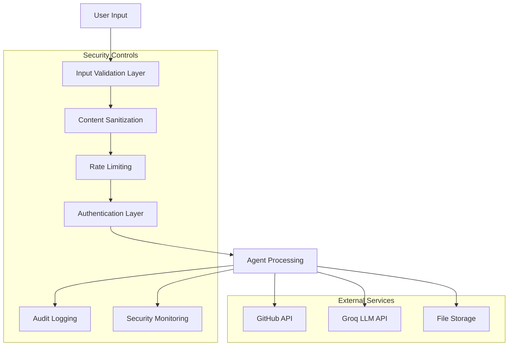

# Security Documentation

## Security Overview

The Gen-Authering Publication Generator implements comprehensive security measures to protect against common vulnerabilities and ensure safe operation in production environments.

## Security Architecture



## Input Validation & Sanitization

### URL Validation

All repository URLs undergo strict validation:

```python
def validate_github_url(url: str) -> str:
    """
    Validates GitHub repository URLs with security checks
    
    Security measures:
    - HTTPS only enforcement
    - GitHub domain restriction
    - Suspicious pattern detection
    - Directory traversal prevention
    """
    
    # Security checks implemented:
    # 1. Protocol validation (HTTPS only)
    # 2. Domain whitelist (github.com only) 
    # 3. Path injection prevention
    # 4. XSS pattern detection
    # 5. Command injection prevention
```

**Protected Against:**
- HTTP protocol downgrades
- Non-GitHub domains
- Directory traversal (`../`)
- XSS attempts (`<script>`, `javascript:`)
- Command injection (`;`, `|`, `$`, backticks)

### Content Sanitization

User-provided markdown content is sanitized:

```python
def sanitize_user_input(user_input: str, max_length: int = 10000) -> str:
    """
    Sanitizes markdown content removing dangerous patterns
    
    Removes:
    - Script tags and JavaScript
    - Event handlers (onclick, onload, etc.)
    - iframes and embeds
    - Object and applet tags
    """
    
    dangerous_patterns = [
        (r'<script[^>]*>.*?</script>', ''),  # Script tags
        (r'javascript:', ''),               # JavaScript URLs
        (r'on\w+\s*=', ''),                # Event handlers
        (r'<iframe[^>]*>.*?</iframe>', ''), # Iframes
        (r'<object[^>]*>.*?</object>', ''), # Objects
        (r'<embed[^>]*>.*?</embed>', ''),   # Embeds
    ]
```

### File Path Security

File operations are restricted to safe directories:

```python
def validate_file_path(file_path: str, allowed_extensions: List[str]) -> str:
    """
    Validates file paths for security
    
    Security measures:
    - Directory traversal prevention
    - Extension whitelisting
    - Suspicious character detection
    - Path canonicalization
    """
    
    # Prevented attacks:
    # - Directory traversal (../)
    # - Null byte injection
    # - Symbolic link attacks
    # - Unauthorized file access
```

## Authentication & Authorization

### API Key Management

```python
class SecureAPIKeyManager:
    """Secure management of API keys and credentials"""
    
    def __init__(self):
        self.keys = {}
        self._load_from_secure_storage()
    
    def _load_from_secure_storage(self):
        """Load keys from environment or secret management service"""
        # Keys are never stored in code or logs
        # Loaded from secure environment variables
        # Support for AWS Secrets Manager, Azure Key Vault, etc.
```

**Best Practices:**
- API keys stored in environment variables only
- No keys in source code or logs
- Automatic key rotation support
- Secure key validation

### Rate Limiting

Multi-layered rate limiting prevents abuse:

```python
# Per-user rate limits
DEFAULT_RATE_LIMITS = {
    'repo_clone': (5, 3600),      # 5 clones per hour
    'pdf_generate': (10, 3600),   # 10 PDFs per hour
    'llm_call': (100, 3600),      # 100 LLM calls per hour
}

class RateLimiter:
    """Token bucket rate limiter with Redis backend"""
    
    def acquire(self, user_id: str, action: str) -> bool:
        """Check if user can perform action within limits"""
        # Implementation with Redis for distributed rate limiting
```

## Secure Communication

### TLS/SSL Configuration

```python
# Production SSL configuration
SSL_CONFIG = {
    'ssl_cert_path': '/etc/ssl/certs/multiagent.crt',
    'ssl_key_path': '/etc/ssl/private/multiagent.key',
    'ssl_protocols': ['TLSv1.2', 'TLSv1.3'],
    'ssl_ciphers': [
        'ECDHE-RSA-AES128-GCM-SHA256',
        'ECDHE-RSA-AES256-GCM-SHA384',
        'ECDHE-RSA-CHACHA20-POLY1305'
    ]
}
```

### External API Security

All external API calls implement security measures:

```python
@retry_with_backoff(max_attempts=3)
@circuit_breaker
def secure_api_call(endpoint: str, **kwargs):
    """
    Secure API wrapper with:
    - Certificate validation
    - Timeout enforcement  
    - Request signing
    - Response validation
    """
    
    # Security measures:
    # 1. SSL certificate validation
    # 2. Request/response timeouts
    # 3. Proper error handling
    # 4. Request signing where supported
```

## Audit Logging & Monitoring

### Security Event Logging

```python
class SecurityAuditLogger:
    """Comprehensive security event logging"""
    
    def log_validation_error(self, error: str, user_input: str, user_id: str):
        """Log input validation failures"""
        
    def log_security_violation(self, violation: str, details: Dict[str, Any]):
        """Log security policy violations"""
        
    def log_rate_limit_exceeded(self, action: str, user_id: str):
        """Log rate limiting violations"""
```

**Logged Events:**
- Failed input validation attempts
- Suspicious URL patterns
- Rate limit violations
- Authentication failures
- File access attempts outside allowed directories
- Unusual usage patterns

### Real-time Monitoring

```python
class SecurityMonitor:
    """Real-time security monitoring and alerting"""
    
    def detect_anomalies(self, events: List[Event]) -> List[Anomaly]:
        """Detect suspicious patterns in user behavior"""
        
    def alert_security_team(self, anomaly: Anomaly):
        """Send alerts for critical security events"""
```

**Monitored Metrics:**
- Request rate anomalies
- Repeated validation failures
- Unusual file access patterns
- Geographic access anomalies
- Failed authentication attempts

## Vulnerability Management

### Static Code Analysis

```bash
# Security scanning with Bandit
bandit -r agents/ tools/ utils/ -f json -o security-report.json

# Dependency vulnerability scanning
safety check --json --output vulnerability-report.json

# Code quality and security linting
flake8 --select=E,W,F,C,N --statistics
```

### Container Security

```dockerfile
# Security-hardened Dockerfile
FROM python:3.9-slim

# Create non-root user
RUN groupadd -r appuser && useradd -r -g appuser appuser

# Set secure permissions
RUN chown -R appuser:appuser /app
USER appuser

# Remove unnecessary packages
RUN apt-get update && apt-get install -y --no-install-recommends \
    git curl \
    && rm -rf /var/lib/apt/lists/* \
    && apt-get clean

# Security labels
LABEL security.policy="restricted"
LABEL security.scan="enabled"
```

### Regular Security Updates

```yaml
# GitHub Actions security workflow
name: Security Scan
on:
  push:
    branches: [main]
  schedule:
    - cron: '0 0 * * 1'  # Weekly

jobs:
  security-scan:
    runs-on: ubuntu-latest
    steps:
      - uses: actions/checkout@v2
      
      - name: Run Bandit Security Scan
        run: bandit -r . -f json -o bandit-report.json
      
      - name: Run Safety Check
        run: safety check --json --output safety-report.json
      
      - name: Container Security Scan
        run: |
          docker build -t multiagent-system .
          docker run --rm -v /var/run/docker.sock:/var/run/docker.sock \
            aquasec/trivy image multiagent-system
```

## Data Protection

### Personal Information Handling

The system is designed to minimize personal data collection:

```python
class DataProtectionMixin:
    """GDPR/CCPA compliance helpers"""
    
    def anonymize_user_data(self, data: Dict) -> Dict:
        """Remove or hash personally identifiable information"""
        
    def purge_user_data(self, user_id: str):
        """Complete removal of user data (GDPR Right to be Forgotten)"""
        
    def export_user_data(self, user_id: str) -> Dict:
        """Export user data (GDPR Right to Access)"""
```

**Data Minimization:**
- No persistent user account storage
- Session-based processing only
- Automatic cleanup of temporary files
- Configurable data retention periods

### Encryption

```python
# Encryption for sensitive data at rest
from cryptography.fernet import Fernet

class DataEncryption:
    """Encrypt sensitive data before storage"""
    
    def __init__(self):
        self.key = os.environ.get('ENCRYPTION_KEY')
        self.cipher_suite = Fernet(self.key)
    
    def encrypt_sensitive_data(self, data: str) -> bytes:
        """Encrypt data before storage"""
        return self.cipher_suite.encrypt(data.encode())
    
    def decrypt_sensitive_data(self, encrypted_data: bytes) -> str:
        """Decrypt data after retrieval"""
        return self.cipher_suite.decrypt(encrypted_data).decode()
```

## Incident Response

### Security Incident Classification

| Severity | Description | Response Time | Actions |
|----------|-------------|---------------|---------|
| **Critical** | Active attack, data breach | < 15 minutes | Immediate shutdown, team mobilization |
| **High** | Vulnerability exploitation | < 1 hour | Service degradation, emergency patch |
| **Medium** | Suspicious activity detected | < 4 hours | Investigation, monitoring increase |
| **Low** | Policy violations, failed attempts | < 24 hours | Log review, pattern analysis |

### Automated Response

```python
class IncidentResponseSystem:
    """Automated security incident response"""
    
    def handle_critical_incident(self, incident: SecurityIncident):
        """Immediate response to critical security incidents"""
        
        # 1. Isolate affected systems
        self.isolate_system()
        
        # 2. Preserve evidence
        self.capture_forensic_data()
        
        # 3. Notify security team
        self.alert_security_team(incident)
        
        # 4. Begin remediation
        self.start_remediation_workflow(incident)
```

### Recovery Procedures

```bash
#!/bin/bash
# Security incident recovery script

# 1. Stop affected services
systemctl stop multiagent-system

# 2. Backup current state for forensics
tar -czf incident-backup-$(date +%Y%m%d-%H%M%S).tar.gz /app/logs /app/data

# 3. Update system and dependencies
apt update && apt upgrade -y
pip install --upgrade -r requirements.txt

# 4. Reset secrets and API keys
python scripts/rotate_secrets.py

# 5. Restart with enhanced monitoring
systemctl start multiagent-system
systemctl enable fail2ban
```

## Security Testing

### Penetration Testing Checklist

- [ ] **Input Validation**: Test all input fields for XSS, SQLi, command injection
- [ ] **Authentication**: Test session management, token validation
- [ ] **Authorization**: Verify access controls and privilege escalation
- [ ] **File Upload**: Test file type validation, size limits, malicious content
- [ ] **API Security**: Test rate limiting, parameter tampering, IDOR
- [ ] **Infrastructure**: Network scans, service enumeration, configuration review

### Automated Security Testing

```python
# pytest security tests
class TestSecurityValidation:
    """Automated security validation tests"""
    
    def test_xss_prevention(self):
        """Test XSS attack prevention in user inputs"""
        malicious_inputs = [
            '<script>alert("xss")</script>',
            'javascript:alert("xss")',
            ''
        ]
        
        for malicious_input in malicious_inputs:
            sanitized = sanitize_user_input(malicious_input)
            assert '<script>' not in sanitized
            assert 'javascript:' not in sanitized
    
    def test_directory_traversal_prevention(self):
        """Test directory traversal attack prevention"""
        malicious_paths = [
            '../../../etc/passwd',
            '..\\..\\windows\\system32\\config\\sam',
            '/etc/shadow'
        ]
        
        for path in malicious_paths:
            with pytest.raises(SecurityViolationError):
                validate_file_path(path)
    
    def test_rate_limiting(self):
        """Test rate limiting enforcement"""
        # Simulate rapid requests
        for _ in range(100):
            response = client.post('/api/process', json={'repo_url': 'https://github.com/test/repo'})
        
        # Should eventually return 429 Too Many Requests
        assert response.status_code == 429
```

## Compliance

### Security Standards Compliance

The system implements security controls aligned with:

- **OWASP Top 10**: Protection against common web vulnerabilities
- **NIST Cybersecurity Framework**: Comprehensive security program
- **ISO 27001**: Information security management
- **SOC 2 Type II**: Security and availability controls

### Compliance Checklist

#### OWASP Top 10 Protection

- [x] **A01 - Broken Access Control**: Role-based access controls implemented
- [x] **A02 - Cryptographic Failures**: TLS encryption, secure key storage
- [x] **A03 - Injection**: Input validation, parameterized queries
- [x] **A04 - Insecure Design**: Secure architecture, threat modeling
- [x] **A05 - Security Misconfiguration**: Secure defaults, hardened configs
- [x] **A06 - Vulnerable Components**: Dependency scanning, updates
- [x] **A07 - Authentication Failures**: Secure session management
- [x] **A08 - Software Integrity**: Code signing, CI/CD security
- [x] **A09 - Logging Failures**: Comprehensive security logging
- [x] **A10 - SSRF**: URL validation, request filtering

## Security Configuration

### Production Security Settings

```python
# config/security.py
PRODUCTION_SECURITY_CONFIG = {
    'input_validation': {
        'max_url_length': 2048,
        'allowed_domains': ['github.com'],
        'max_file_size_mb': 25,
        'max_content_length': 10000
    },
    
    'rate_limiting': {
        'requests_per_minute': 60,
        'requests_per_hour': 1000,
        'requests_per_day': 10000
    },
    
    'encryption': {
        'algorithm': 'AES-256-GCM',
        'key_rotation_days': 90,
        'hash_algorithm': 'SHA-256'
    },
    
    'logging': {
        'log_sensitive_data': False,
        'log_retention_days': 90,
        'enable_audit_trail': True
    },
    
    'ssl': {
        'min_tls_version': 'TLSv1.2',
        'cipher_suites': ['ECDHE-RSA-AES256-GCM-SHA384'],
        'hsts_max_age': 31536000  # 1 year
    }
}
```

### Environment-Specific Security

```yaml
# Security configuration by environment
development:
  security:
    strict_validation: false
    debug_logging: true
    rate_limiting: relaxed

staging:
  security:
    strict_validation: true
    debug_logging: false
    rate_limiting: moderate
    
production:
  security:
    strict_validation: true
    debug_logging: false
    rate_limiting: strict
    enable_waf: true
    enable_ddos_protection: true
```

## Security Contact

### Responsible Disclosure

For security vulnerabilities, please contact:

- **Email**: security@yourcompany.com
- **PGP Key**: [Public key fingerprint]
- **Response Time**: Within 24 hours for critical issues

### Bug Bounty Program

We maintain a responsible disclosure program:

- **Scope**: Production systems and core application
- **Excluded**: Social engineering, physical attacks, DoS attacks
- **Rewards**: Based on severity and impact assessment

### Security Advisory Process

1. **Report**: Submit vulnerability via secure channels
2. **Acknowledge**: Team acknowledges receipt within 24h
3. **Assess**: Security team evaluates impact and severity
4. **Fix**: Development team creates and tests patch
5. **Deploy**: Emergency deployment for critical issues
6. **Disclose**: Public disclosure after fix deployment